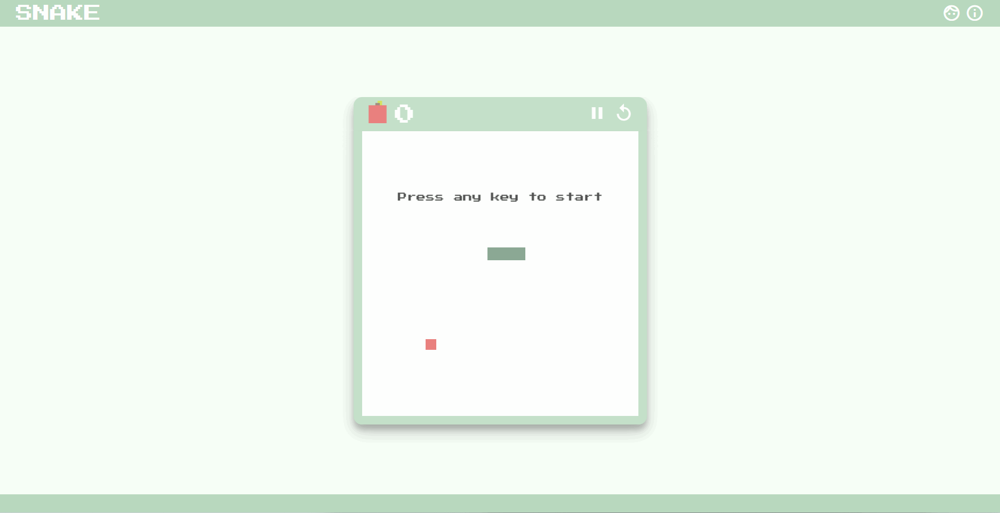

# Snake Game - JavaScript
 
Projeto criado com o propósito de pôr em prática estudos previamente realizados nas tecnologias JavaScript, HTML e CSS. Consiste no clássico jogo Snake, criado de uma forma a qual não foi necessário utilizar canvas mas sim manipular os elementos HTML e seu estilo a partir do script.

## [Link](https://amaralltx.github.io/snakegame/)

## Visual do Projeto

